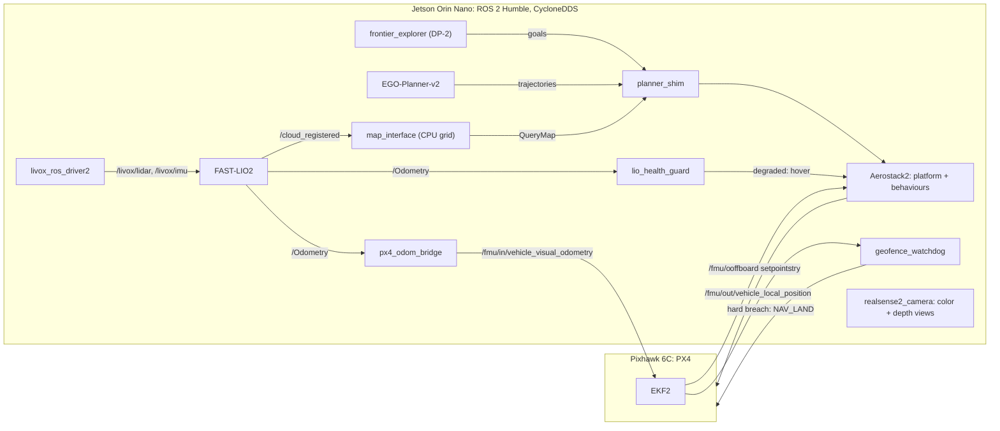

<!-- filepath: README.md -->
# MappingUAV

Indoor, GPS-denied autonomy for a single Holybro X500: LiDAR-inertial odometry
fused into PX4, an Aerostack2 behaviour layer, obstacle-aware waypoint
navigation, and autonomous exploration inside an operator-defined geofence, all
running on a Jetson Orin Nano.

## Mission

1. **Autonomous exploration** of an indoor space inside a pre-set geofence box,
   producing a 3D map.
2. **Waypoint navigation with obstacle avoidance.**

Out of scope for now: outdoor/GPS operation and multi-drone. Nothing built here
may preclude a later multi-drone phase.

## Hardware

| Role | Part |
|---|---|
| Airframe | Holybro X500 V2 |
| Flight controller | Pixhawk 6C, PX4 v1.15.x |
| Primary sensor | Livox Mid-360 LiDAR (built-in IMU), Ethernet |
| Aiding | HereFlow optical flow (DroneCAN), Benewake TF02 downward rangefinder |
| Camera | Intel RealSense D435i: color and depth image views only (no point cloud, IMU off) |
| Companion | Jetson Orin Nano 8 GB, JetPack 6 (L4T R36.5), Ubuntu 22.04, ROS 2 Humble |
| FC link | uXRCE-DDS over TELEM2 ↔ Jetson UART at 921600 baud |

## Architecture



Design rules the code is built around:

- **One estimator of record: EKF2.** `px4_odom_bridge` is the only writer of
  PX4's external-vision input. Everything downstream (Aerostack2, planners,
  watchdog) consumes PX4's fused estimate, never raw LIO.
- **One command path.** Planners → `planner_shim` (validates goals and
  trajectories against the geofence and limits) → Aerostack2 → PX4 offboard.
  No planner talks to PX4 directly.
- **Independent safety.** `geofence_watchdog` depends only on PX4 topics. Soft
  breach: alert and hover. Hard breach, invalid estimate, or LIO silence over
  1 s: it commands `NAV_LAND` itself, bypassing the behaviour layer.
- **Frames.** Planning happens in `odom` (ENU), which is FAST-LIO's world frame.
  There is no compass indoors, so PX4's local NED frame is derived from it:
  **North = the vehicle's startup left, East = its startup forward**, and PX4
  reads a heading of about +90° right after LIO starts. The geofence box is
  specified in this NED frame.
- **Compute ceiling.** Map server + planner + behaviours together: 2.0 CPU
  cores and 2.5 GB RAM, measured at Gate 6.

## Gates

Integration proceeds through gated milestones. Authorisation lives in
[`docs/gate_status.yaml`](docs/gate_status.yaml), which only the human operator
edits. Anything that touches the physical vehicle is human-executed from a
runbook.

| Gate | Milestone | Pass criteria (abridged) |
|---|---|---|
| 1 | uXRCE-DDS link | `/fmu/out/*` visible, timesync < 1 ms, stable 10 min |
| 2 | FAST-LIO2 bench (hand-carry) | 10 Hz cloud, ~200 Hz IMU, return-to-start < 5 cm, no z drift over 5 min |
| 3 | EKF2 fusion | PX4 tracks LIO with correct signs; zero EKF resets over a 5 min carry |
| 4 | Tethered hover | ±10 cm hold for 2 min, zero EKF resets, no LIO degradation |
| 5 | Aerostack2 behaviours | takeoff / go_to / land; `missions/bench_box.py` (2×2 m square at 0.5 m) |
| 6 | Planner in the loop | closed-loop `go_to_with_avoidance`; compute ceiling measured |
| 7 | Exploration | autonomous exploration in the geofence; entry requires a deliberate watchdog trip test |

Verification helpers: `scripts/verify_gate1.sh` … `verify_gate3.sh` and
[`docs/gate4_prep_checklist.txt`](docs/gate4_prep_checklist.txt). Anything that
cannot be tested without a simulator or the vehicle is logged as verification
debt (`docs/verification_debt.yaml` on the work-package branches).

## Decisions

| Decision | Outcome |
|---|---|
| DP-1 mapping backend | **CPU_GRID**: OctoMap v1.10 + dynamicEDT3D, 0.2 m voxels, bounded to the geofence (operator decision 2026-09-12). nvblox was rejected: it has no ingestion path for the Mid-360's non-repetitive scan, and needs the heavy Isaac ROS stack on an 8 GB board. |
| DP-2 exploration planner | **FRONTIER**: an in-house frontier explorer on the CPU grid, sending validated goals through `planner_shim` (operator decision 2026-09-12). TARE was not chosen (a ground-vehicle planner whose aerial variant is commercial), nor FUEL (no ROS 2 port). Spec: [`docs/wp-f_frontier_explorer_spec.md`](docs/wp-f_frontier_explorer_spec.md); verified reference prototype: [`tools/frontier_prototype/`](tools/frontier_prototype/). |
| Middleware | CycloneDDS on the vehicle. Zenoh only at a future multi-drone network boundary. |
| D435i role | Color + depth views only; 3D perception comes from the Mid-360. |

## Branches

`main` carries the Gates 1–4 infrastructure, ground-station tooling and project
docs. Each Phase 3–7 work package lives on its own branch and is merged only
when its gate token is confirmed, so these are unmerged by design.

| Branch | Work package | Status |
|---|---|---|
| `wp-e-geofence-watchdog` | Geofence watchdog (safety-critical) | VERIFIED: 47 unit tests, zero debt |
| `wp-g-ops` | systemd boot chain, flight-session recorder | VERIFIED at host level (1 debt entry) |
| `wp-c-mapping` | `map_interface` + CPU grid, `map_export` | VERIFIED on synthetic clouds (real-data debt open) |
| `wp-f-dp2-survey` | FUEL vs TARE survey | EVIDENCE_ONLY |
| `wp-b-as2` | Aerostack2 skeleton, `as2_platform_pixhawk` | BUILT_UNVERIFIED |
| `wp-d-planner` | EGO-Planner-v2 pipeline, `planner_shim`, `lio_health_guard` | BUILT_UNVERIFIED |

## Repository layout (`main`)

```text
src/drone_bringup/     launch files + configs for every gate (no nodes)
src/px4_odom_bridge/   FAST-LIO2 → PX4 external-vision bridge (+ unit tests)
scripts/               environment setup, per-gate verification, run_qgc.sh
docker/qgc/            QGroundControl container (the aarch64 AppImage needs a newer glibc than JetPack 6)
deploy/                third-party pins (third_party.repos) and patches
docs/                  gate status, runbooks, pinned versions, build report, WP-F explorer spec
tools/frontier_prototype/  verified reference prototype of the WP-F explorer algorithm (not a ROS package)
```

Third-party sources (`px4_msgs`, `livox_ros_driver2`, `FAST_LIO`,
`as2_platform_pixhawk`, `octomap`, `octomap_msgs`) are not vendored. They are
pinned in [`deploy/third_party.repos`](deploy/third_party.repos) and
[`docs/pinned_versions.md`](docs/pinned_versions.md).

## Getting started

Target: Jetson Orin Nano, Ubuntu 22.04, ROS 2 Humble.

```bash
git clone https://github.com/knnurl/MappingUAV.git ~/colcon_ws
cd ~/colcon_ws
# Read before running: provisions ROS deps, Livox SDK2, the Micro XRCE-DDS Agent.
./scripts/setup_env.sh
vcs import src < deploy/third_party.repos
# Only needed for the Aerostack2 platform (wp-b-as2):
git -C src/as2_platform_pixhawk apply ../../deploy/patches/as2_platform_pixhawk_px4msgs_1.15.patch

# Default colcon parallelism OOMs the 8 GB board (shared CPU/GPU memory).
MAKEFLAGS=-j4 colcon build --symlink-install --parallel-workers 2
source install/setup.bash
```

`livox_ros_driver2` needs its ROS 2 manifest staged before it builds, and its
own `build.sh` must not be used because it wipes the workspace. See
[`docs/build_report_gates1-4.md`](docs/build_report_gates1-4.md).

Run:

```bash
ros2 launch drone_bringup gate3_fusion.launch.py   # XRCE agent + Livox + FAST-LIO2 + bridge
ros2 launch drone_bringup d435i.launch.py          # camera color + depth views
colcon test --packages-select px4_odom_bridge      # bridge unit tests
```

Visualise off-board from a ground station on the same `ROS_DOMAIN_ID`. RViz
never runs on the vehicle. Over WiFi, view the camera through compressed
`image_transport`, not raw images.

## Safety

- Props off for all bench work. Every step touching the vehicle comes from a
  runbook and is executed by a human.
- The watchdog must be running before any autonomy is trusted (Gate 5 onward).
- Never record raw `/livox/lidar` in flight. PX4 `.ulg` logs are the primary
  flight record.

## Documentation

- [`docs/px4_reflash_runbook.md`](docs/px4_reflash_runbook.md): ArduPilot → PX4 migration
- [`docs/build_report_gates1-4.md`](docs/build_report_gates1-4.md): build and discrepancy report
- [`docs/pinned_versions.md`](docs/pinned_versions.md): third-party pins

## License

No license file yet. The ROS package manifests declare MIT.
